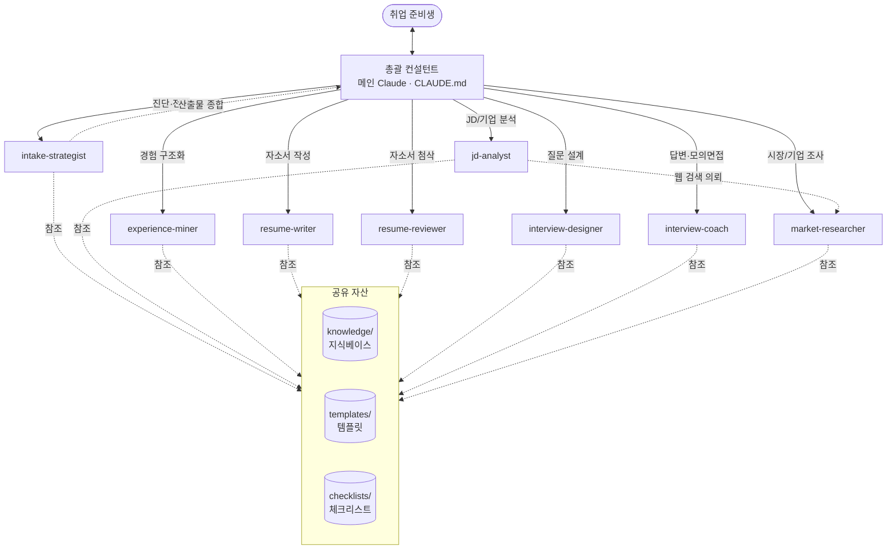
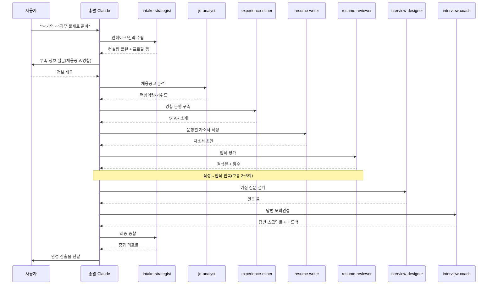

# 02. 설계 (Design)

## 1. 아키텍처 개요

JobHub는 **총괄 컨설턴트(메인 Claude)** 가 **전담 컨설턴트(서브에이전트)** 에게 작업을 위임하는 오케스트레이터-워커 구조다.



- **총괄 컨설턴트**는 사용자와 직접 대화하며, 요청을 분해하고 적절한 에이전트를 호출하고 결과를 종합한다.
- **각 에이전트**는 단일 책임(Single Responsibility)을 가지며, 표준 템플릿 형식으로 산출물을 반환한다.
- **공유 자산**(지식·템플릿·체크리스트)은 모든 에이전트가 참조해 품질·일관성을 보장한다.

## 2. 표준 컨설팅 워크플로우



### 단계별 의존성

| 단계 | 입력 | 담당 | 출력 |
|---|---|---|---|
| 1 인테이크 | 사용자 요청 | intake-strategist | 컨설팅 플랜, 프로필 |
| 2 JD 분석 | 채용공고 | jd-analyst (+market-researcher) | JD 분석서 |
| 3 경험 정리 | 사용자 경험 | experience-miner | 경험 은행 |
| 4 자소서 작성 | JD 분석서 + 경험 은행 | resume-writer | 자소서 초안 |
| 5 첨삭 | 자소서 초안 + JD | resume-reviewer | 첨삭본 + 점수 |
| 6 질문 설계 | JD + 자소서 | interview-designer | 질문 풀 |
| 7 답변/모의 | 질문 풀 + 경험 은행 | interview-coach | 답변 + 피드백 |
| 8 종합 | 전 산출물 | intake-strategist | 종합 리포트 |

> 사용자는 **어느 단계든 단독 진입** 가능하다(예: "이 자소서만 첨삭"). 총괄 Claude는 누락된 선행 입력을 사용자에게 빠르게 보완 질문한다.

## 3. 에이전트 설계 규약

각 에이전트 정의(`.claude/agents/*.md`)는 다음을 포함한다.

- **YAML frontmatter**: `name`, `description`(호출 트리거), `tools`(권한 최소화), `model`
- **역할(Role)**: 정체성과 전문성
- **운영 원칙(Principles)**: 반드시 지킬 규칙(근거주의·창작금지 등)
- **입력/출력 계약(I/O Contract)**: 무엇을 받고 무엇을 반환하는지
- **작업 절차(Process)**: 단계별 수행 방법
- **품질 기준(Quality Bar)**: 자가 점검 항목
- **핸드오프(Handoff)**: 다음 단계로 넘길 산출물/주의사항
- **참조(References)**: 사용할 `knowledge/`, `templates/`, `checklists/`

### 모델 & 도구 배정 원칙

| 성격 | 에이전트 | 모델 | 주요 도구 |
|---|---|---|---|
| 창작·판단 집약 | resume-writer, resume-reviewer, interview-coach, intake-strategist | opus | Read, Write, Edit, Glob, Grep |
| 분석·구조화 | jd-analyst, experience-miner, interview-designer | sonnet | Read, Write, Edit, Glob, Grep |
| 외부 조사 | market-researcher | sonnet | Read, Write, WebSearch, WebFetch |

## 4. 핸드오프(컨텍스트 전달) 설계

서브에이전트는 독립 컨텍스트에서 실행되므로, 맥락은 **명시적 산출물 파일/구조화 텍스트**로 전달한다.

- 각 단계 산출물은 `templates/`의 표준 형식을 따른다 → 다음 에이전트가 파싱 가능.
- 실제 컨설팅 진행 시 산출물을 `work/<지원자>/` 같은 작업 폴더에 저장(런타임 생성)하면, 후속 에이전트가 `Read`로 참조.
- 총괄 Claude는 호출 시 **이전 산출물의 핵심을 프롬프트에 요약·첨부**한다.

## 5. 파일 구조 (최종)

```
jobhub/
├── README.md
├── CLAUDE.md                       # 팀 운영 규칙 + 라우팅
├── docs/
│   ├── 01-기획.md
│   ├── 02-설계.md                  # 현재 문서
│   ├── 03-검증.md
│   └── 04-종결.md
├── .claude/agents/
│   ├── intake-strategist.md
│   ├── jd-analyst.md
│   ├── experience-miner.md
│   ├── resume-writer.md
│   ├── resume-reviewer.md
│   ├── interview-designer.md
│   ├── interview-coach.md
│   └── market-researcher.md
├── knowledge/
│   ├── korea-job-market.md         # 한국 채용 프로세스/관행
│   ├── star-method.md              # STAR/경험 구조화
│   ├── cover-letter-guide.md       # 자소서 문항/작법
│   ├── interview-guide.md          # 면접 유형/대비
│   └── evaluation-rubric.md        # 평가 루브릭
├── templates/
│   ├── candidate-profile.md
│   ├── jd-analysis.md
│   ├── experience-bank.md
│   ├── cover-letter.md
│   ├── interview-qa.md
│   └── consulting-report.md
├── checklists/
│   ├── cover-letter-checklist.md
│   └── interview-checklist.md
└── examples/sample-candidate/      # 엔드투엔드 예제
    ├── 00-profile.md
    ├── 01-jd-analysis.md
    ├── 02-experience-bank.md
    ├── 03-cover-letter.md
    ├── 04-cover-letter-review.md
    ├── 05-interview-questions.md
    └── 06-interview-answers.md
```

## 6. 품질 & 윤리 가드레일 (전 에이전트 공통)

1. **근거주의**: 모든 주장에 경험/수치/사실 근거. 없으면 사용자에게 질문.
2. **창작 금지**: 경험을 발굴·강조하되 없는 경력·수치를 지어내지 않는다.
3. **검증 전제**: 산출물은 "초안"이며 본인 검토·소화를 명시한다.
4. **한국시장 정합**: 글자수, 문항형, 블라인드/NCS, 인적성·AI면접 반영.
5. **클리셰 배격**: 추상적 미사여구 대신 구체·정량.

## 7. 확장 포인트 (향후)

- 산업/직군별 지식 모듈 추가(`knowledge/industry/*`)
- 기업별 인재상 데이터셋
- 음성/영상 모의면접 연계
- 독립 앱(웹/CLI)으로 오케스트레이션 이식 — 본 설계의 역할·워크플로우를 그대로 서비스화 가능
